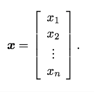
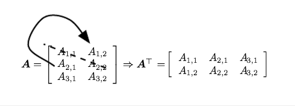
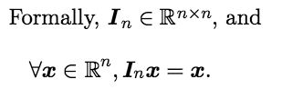

# 第二章 线性代数基础
## 2.1 标量（Scalars），向量（Vectors），矩阵（Matrices）和张量（Tensors）
* Scalars：就是一个简单的数。常用小写斜体表示
* Vectors：一个数字阵列，数是按序排列好的，往往使用小写黑体表示向量。向量的元素通常用带数字下标的斜体表示，向量的正确表示形式：

我们可以把向量看作是一个空间中的点，每一个元素提供各自轴上的坐标

* Matrices：矩阵就是一个二维的数列，常用大写黑体表示
矩阵的转置（transpose）：

* Tensors：多个（大于2）axes的数列称为张量

transpose（转置）：转置就是原matrix沿着对角线的镜像，对角线称为main diagonal（主对角线），对于转置矩阵，有：

$(\mathbf {A} ^\mathrm{T} )_{i,j} = \mathbf {A}_{j,i} $

一个vector可以看作是只有一列的matrix，经常会看到row形式的matirx，这个时候我们通过加一个转置符号来把它变成标准的vector，像这样：

$$\mathbf x = [x_1, x_2, x_3]^\mathrm{T} $$

我们可以将两个Matrix相加，前提是它们具有相同的shape（行列），Matrix相加的规则就是对matrix逐元素做加法运算，也可以将Scalar和Matrix相加和相乘，逐个元素做运算，得到和原Matrix相同shape的Matrix。

在深度学习中，我们还会使用一些不符合传统的符号，我们允许Matrix和Vector做加法，像这样：

$$\mathbf {C} = \mathbf{A} + b$$  

也就是说：

$$C_{i,j} = A_{i,j} + b_j$$

换句话说，vector b就是被加到了matrix的每一行，其实就相当于b被复制到每一行。这种向量复制操作被称为broadcasting

## 2.2 Matrices和Vector乘法
矩阵乘法是最重要的运算之一。

$$\mathbf{C} = \mathbf{AB}$$   

A的列数=B的行数
Ci,j = A的i行 B的j列求乘和
 向量的x，y的dot乘法 ===》xTy

那么，我们现在就可以理解这样一个等式的意义了：

$$\mathbf {Ax = b}    (1)$$

其中A是m行n列， x是长度为n的向量，b是一个长度为m的向量
等式（1）可以表示为：

$$\mathbf A_{1, :}\mathbf x = b_1 $$

$$\mathbf A_{2, :}\mathbf x = b_2$$

$$...$$

$$\mathbf A_{m, :}\mathbf x = b_m$$

2.3 矩阵的逆（Matrix Inversion）
我们定义$$I_n$$为一致矩阵，有：

我们定义A的逆矩阵为：

$$\mathbf A^{-1}\mathbf A = \mathbf I_n$$

则有：

$$\mathbf {Ax = b}  $$

$$\mathbf A^{-1}\mathbf {Ax} = \mathbf{A^{-1}b} $$

$$\mathbf {I_nx} = \mathbf{A^{-1}b} $$

$$\mathbf x = \mathbf{A^{-1}b} $$

逆矩阵的存在方便了（1）的求解，但是你矩阵求解（1）只在理论使用（精度不够）

## 2.4 线性独立和张成子空间（Span）
$$\mathbf{Ax} = \sum_i{x_i\mathbf A_{:,i}}$$

这种操作被称为线性组合

Span的概念也比较容易解释：

假设一个set E是由$\{x_1,x_2,x_3...\}$这些元素组成的，那么Span E就是由所有这些元素的线性组合组成的一个set，即：

很容易看出来Span满足linear space的条件所以Span也是一个liear space

等式（1）对任意b有解的充要条件是：matrix必须包含至少一个有m个线性独立列的集合（为了让matrix的列空间能够包含m维的实数）

为了让矩阵有逆，我们还需要额外保证等式（1）对b的所有值至多只有一个解。因此，我们需要保证matrix至多只有m列

结合以上两条，matrix必须为方阵（square），即m=n，并且所有的列都必须是线性独立的。所有列都是线性独立的方阵我们称之为singular

## 2.5 Norms（范数）
范数的定义（来自wiki）：具有长度概念的函数。在线性代数中，是一个函数，其为向量空间内所有向量赋予非零的正长度。最简单的就是实数空间中的绝对值，还有欧式空间中的向量摩长。

有时，我们需要度量vector的size，在ML中，我们使用一个被称为norm的函数来measure向量的size。
L^p范式：

直观上理解，一个向量的范式度量了从原点到向量x的距离。更加严谨的说，任何函数f只要满足如下的属性都可称为norm：

L^2范式就是我们常说的欧几里得范式，就是算了原点到向量确定的点的欧式距离，我们简单的表示为||x||。

#### 个人私货：
* L1范数:  ||x|| 为x向量各个元素绝对值之和。
* L2范数:  ||x||为x向量各个元素平方和的1/2次方，L2范数又称Euclidean范数或者Frobenius范数
* Lp范数:  ||x||为x向量各个元素绝对值p次方和的1/p次方
* L∞范数:  ||x||为x向量各个元素绝对值最大那个元素的绝对值，如下：

> **椭球向量范数**: $||x||A  = sqrt[T(x)Ax]$， $T(x)$代表$x$的转置。定义矩阵$C$，为M个模式向量的协方差矩阵， 设C’是其逆矩阵，则Mahalanobis距离定义为$$||x||C’  = sqrt[T(x)C’x]$$ 这是一个关于C’的椭球向量范数。

> **欧式距离**（对应L2范数）：最常见的两点之间或多点之间的距离表示法，又称之为欧几里得度量，它定义于欧几里得空间中。n维空间中两个点$$x_1(x_{11},x_{12},…,x_{1n})$$与 $$x_2(x_{21},x_{22},…,x_{2n})$$间的欧氏距离：
> 
> $$d_{12} = \sqrt{\sum_{k=1}^{n}{(x_{1k} - x_{2k})^2}}$$
> 
> 也可以用表示成向量运算的形式：
> 
> $$d_{12} = \sqrt{(a - b)(a - b)^T}$$
> 
> **曼哈顿距离**：曼哈顿距离对应L1-范数，也就是在欧几里得空间的固定直角坐标系上两点所形成的线段对轴产生的投影的距离总和。例如在平面上，坐标（x1, y1）的点P1与坐标（x2, y2）的点P2的曼哈顿距离为：，要注意的是，曼哈顿距离依赖座标系统的转度，而非系统在座标轴上的平移或映射。
> **切比雪夫距离**: 若二个向量或二个点x1和x2，其坐标分别为$$(x_{11},x_{12},…,x_{1n})$和$(x_{21},x_{22},…,x_{2n})$$则二者的切比雪夫距离为：$$d = max(|x1i - x2i|)$$i从1到n。对应L∞范数。
> **闵可夫斯基距离**(_Minkowski Distance_)，闵氏距离不是一种距离，而是一组距离的定义。对应Lp范数，p为参数。
> 闵氏距离的定义：两个n维变量（或者两个n维空间点）$$x_1(x_{11},x_{12},…,x_{1n})$$与 $$x_2(x_{21},x_{22},…,x_{2n})$$间的闵可夫斯基距离定义为
> 
> $$d_{12} = \sqrt[p]{\sum_{k = 1}^{n}{\left|x_{1k} - x_{2k}\right|^p}}$$
> 
> 其中p是一个变参数。
> 当p=1时，就是曼哈顿距离，
> 当p=2时，就是欧氏距离，
> 当p→∞时，就是切比雪夫距离，
> 根据变参数的不同，闵氏距离可以表示一类的距离。
> **Mahalanobis距离**：也称作马氏距离。在近邻分类法中，常采用欧式距离和马氏距离。

在计算上和数学上二范式的平方都带来更大的便利，比如说，二范式的平方的导数只和向量的每个元素有关，但是单纯的二范式的导数和整个向量都有关。

在很多情况下，二范式的平方并不被使用因为他在原点附近increase very slowly。在某些ML应用中，我们希望严格区分0和一些很小但是非0的元素。在这种情况下，我们转向一个在各个位置都有相同的增长速率但是又保持数学朴素性的norm：L^1 norm

$$\| \mathbf x\|_1 = \sum_{i}{\left| x_i\right|}$$

L1范式被广泛使用在0和非0区别很重要的ML算法中。

max norm也被经常用于ML中

## 2.6 一些特殊的Matrices和Vectors

- Diagonal matrices
- symmetric matrix
- unit vector
- orthogonal vectors(正交向量) x^T y = 0
- orthogonal matrix

## 2.7 特征分解
很多数学对象都可以通过把它们拆分成子成分来更好的理解他们本身的属性，比如说把一个整数做分解：$ 12 = 2 * 2 * 3$通过这种分解的形式我们就可以发现12不能被5整除，以及任何一个数如果能被12整除则也能被3整除。
就像把整数分解那样，我们也可以把Matrix做分解以显现出它作为一个Matrix的形式不是那么明显的属性。

一种使用广泛的矩阵分解方法——特征分解（eigendecomposition）

方阵**A**的**特征向量（eigenvector）**是一个非零的向量$v$是方阵$\mathbf A$的特征向量当：
	$$\mathbf{Av} = \lambda \mathbf v $$
$\lambda$被称为关于该特征向量的特征值

组合所有的$\mathbf v$和$\lambda$称为一个矩阵和向量：
$$\mathbf A = \mathbf V diag(\mathbf{\lambda} \mathbf V^{-1})$$
并不是所有的Matrix都可以做特征分解

$f(\mathbf x) = \mathbf x^T\mathbf{Ax} $服从$\left \lVert x \right \rVert_2 = 1$

一个Matrix的所有的eigenvalues都是正的的话，这个Matrix是正定的（positive definite）
	
## 2.8 Singular Value Decomposition(SVD)
SVD提供了另一种使Matrix元素化的方法：把它分解成singular vectors和singular values，SVD比特征分解更常用（特征分解不能用于非方阵）
$$\mathbf A = \mathbf{UDV}^T$$

- A: m\*n
- U: m\*m
- D: m\*n
- V: n\*n

> The elements along the diagonal of D are known as the singular values of the matrix A. The columns of U are known as the left-singular vectors. The columns of V are known as the right-singular vectors.

## 2.9 The Moore-Penrose Pseudoinverse

## 2.10 The Trace Operator（矩阵的迹）
Trace 就是求一个矩阵的对角（diagonal）元素的和
$$Tr(\mathbf A) = \sum_i{\mathbf A_{i,i}}$$

## 2.11 The Determinant（行列式）
一个Matrix的determinant，记做det(A),是一个将matrix映射成一个scalar的函数

> The determinant is equal to the product of all the eigenvalues of the matrix. The absolute value of the determinant can be thought of as a measure of how much multiplication by the matrix expands or contractsspace. If the determinant is 0, then space is contracted completely along at leastone dimension, causing it to lose all of its volume. If the determinant is 1, then the transformation preserves volume.

## 2.12 Example：PCA（Principal Components Analysis）
太长了，有空更新

